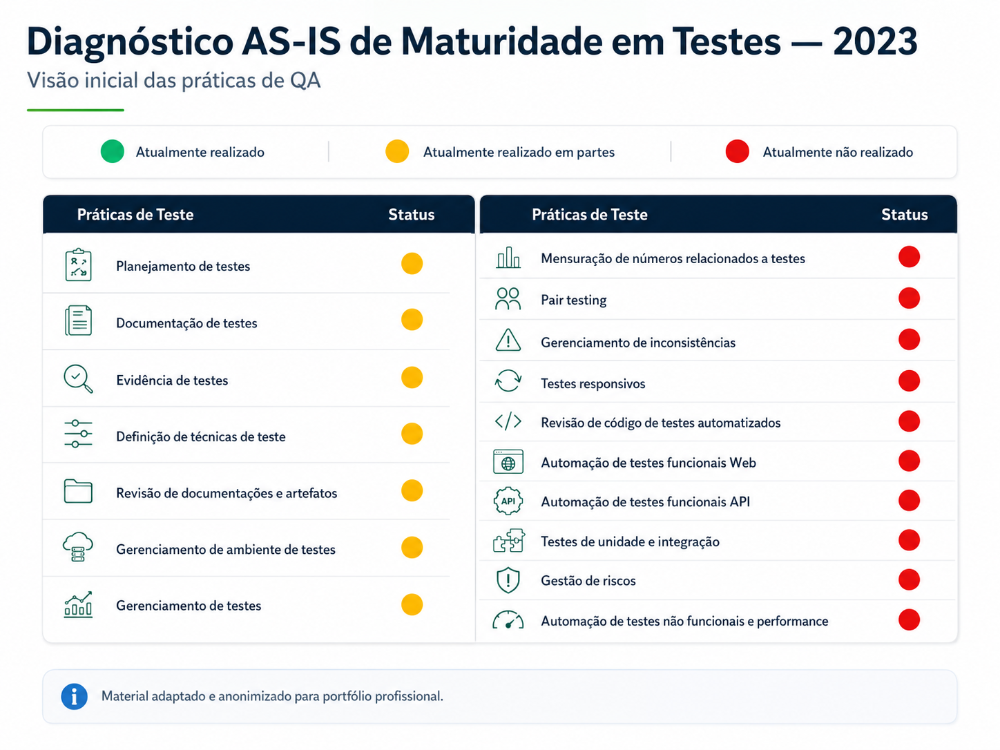

# Case 01 — Diagnóstico AS-IS de Maturidade em QA

## Resumo executivo

| Item | Descrição |
|------|-----------|
| **Período** | 2023 |
| **Papel** | QA Trainee |
| **Contexto** | Empresa sem time formal de QA estruturado |
| **Objetivo** | Mapear a maturidade inicial das práticas de teste |
| **Principal entrega** | Diagnóstico AS-IS de testes de software |
| **Impacto** | Base para estruturação dos primeiros processos de QA |

## Contexto

Em 2023, iniciei minha trajetória em Qualidade de Software em um cenário onde ainda não existia um time formal de QA estruturado.

Naquele momento, os testes eram realizados principalmente por profissionais de produto, sem um processo padronizado de planejamento, documentação, evidência, métricas ou rastreabilidade.

Antes de propor mudanças, foi necessário entender o cenário atual, identificar práticas existentes e mapear as principais lacunas do processo de testes.

---

## Desafio

O principal desafio era compreender o nível de maturidade das práticas de teste da organização e criar uma base para estruturar as primeiras iniciativas de QA.

Era necessário responder perguntas como:

- Quais práticas de teste já existiam?
- Quais eram realizadas parcialmente?
- Quais ainda não eram realizadas?
- Onde estavam as maiores oportunidades de melhoria?
- Como priorizar as primeiras ações de qualidade?

---

## Ação realizada

Elaborei um formulário para levantar informações com os profissionais que realizavam testes na época.

A partir das respostas, consolidei um diagnóstico AS-IS visual, classificando as práticas de teste em três categorias:

- Atualmente realizado;
- Atualmente realizado em partes;
- Atualmente não realizado.

Esse diagnóstico permitiu visualizar o estado inicial do processo de QA e serviu como base para a definição das próximas ações de melhoria.

---

## Principais práticas avaliadas

Entre os pontos avaliados estavam:

- Planejamento de testes;
- Documentação de testes;
- Evidência de testes;
- Técnicas de teste;
- Gestão de inconsistências;
- Gestão de ambiente de testes;
- Métricas relacionadas a testes;
- Testes responsivos;
- Testes de unidade e integração;
- Automação de testes funcionais Web;
- Automação de testes funcionais API;
- Automação de testes não funcionais e performance;
- Gestão de riscos;
- Gerenciamento de testes.

---

## Resultado

O AS-IS trouxe clareza sobre o cenário inicial da qualidade de software e ajudou a direcionar a evolução do processo de QA.

A partir dele, foi possível priorizar iniciativas como:

- Padronização da documentação de testes;
- Criação de evidências;
- Organização do fluxo de QA;
- Planejamento de testes;
- Gestão de bugs e inconsistências;
- Participação do QA em cerimônias ágeis;
- Evolução futura para automação;
- Implantação de métricas e rastreabilidade.

---

## Evidência visual adaptada

A imagem abaixo representa, de forma anonimizada, o diagnóstico AS-IS utilizado para mapear a maturidade inicial das práticas de teste.

---

## Competências demonstradas

- Diagnóstico de processo;
- Análise de maturidade;
- Comunicação com stakeholders;
- Visão crítica;
- Estruturação de QA do zero;
- Priorização de melhorias;
- Qualidade de software;
- Melhoria contínua.

## O que aprendi com este case

Aprendi que antes de propor mudanças em um processo, é essencial entender o cenário atual, ouvir as pessoas envolvidas e transformar percepções em dados organizados.

Esse diagnóstico mostrou que um bom processo de QA começa com clareza: entender o que já existe, o que funciona parcialmente e quais lacunas precisam ser priorizadas.

---

## Observação

Este case foi adaptado e anonimizado para fins de portfólio profissional, preservando informações sensíveis da organização.

---

[⬅ Voltar ao início do portfólio](../README.md)
