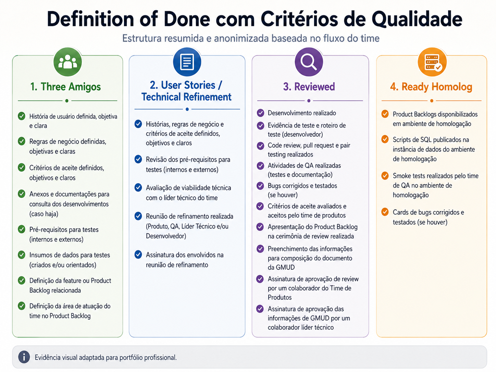

# Case 04 — Definition of Done com Critérios de Qualidade

## Resumo executivo

| Item | Descrição |
|------|-----------|
| **Período** | 2024 |
| **Papel** | QA / Apoio à liderança de processo |
| **Contexto** | Necessidade de definir critérios claros para considerar uma entrega concluída |
| **Objetivo** | Incluir práticas de qualidade no Definition of Done do time |
| **Principal entrega** | DoD com critérios de evidência, testes, documentação, code review, pair testing e aceite |
| **Impacto** | Qualidade passou a fazer parte dos critérios oficiais de conclusão das entregas |

## Contexto

Com a evolução do processo de QA e do fluxo ágil dos times, surgiu a necessidade de deixar mais claro quais critérios deveriam ser cumpridos para que uma entrega fosse considerada concluída.

Antes disso, algumas atividades de qualidade podiam variar conforme o time, a sprint ou o tipo de entrega, o que gerava dúvidas sobre responsabilidades, evidências, validações e aprovações necessárias.

---

## Desafio

O principal desafio era incorporar critérios de qualidade ao Definition of Done do time, garantindo que as entregas só avançassem no fluxo após atenderem pontos mínimos de validação, documentação, revisão e aceite.

A proposta era transformar qualidade em uma responsabilidade compartilhada, e não apenas em uma etapa final executada pelo QA.

---

## Ação realizada

Participei da criação e evolução do Definition of Done do time, incluindo atividades de qualidade nas etapas do processo de desenvolvimento.

Entre os critérios considerados, estavam:

- Evidência de teste;
- Roteiro de teste;
- Code review;
- Pull request;
- Pair testing;
- Atividades de QA realizadas;
- Documentação dos testes;
- Bugs corrigidos e retestados;
- Critérios de aceite avaliados;
- Aprovação do time de Produto;
- Aprovação técnica quando necessário;
- Informações necessárias para mudança e publicação.

---

## Qualidade como critério de conclusão

Com a inclusão desses critérios no DoD, o time passou a ter uma visão mais clara sobre o que precisava acontecer antes de uma atividade ser considerada pronta.

Isso ajudou a alinhar expectativas entre:

- QA;
- Desenvolvimento;
- Produto;
- Liderança técnica;
- Gestão;
- Stakeholders envolvidos na entrega.

---

## Resultado

A criação do Definition of Done com critérios de qualidade contribuiu para:

- Redução de ambiguidades no fluxo;
- Maior clareza sobre responsabilidades;
- Melhor rastreabilidade das validações;
- Maior controle sobre evidências e documentação;
- Fortalecimento da cultura de qualidade;
- Mais alinhamento entre Produto, Desenvolvimento e QA;
- Entregas com critérios mais objetivos de conclusão.

---

## Evidência visual adaptada

O Definition of Done do time foi estruturado por etapas do fluxo, com critérios específicos em cada coluna do board.

Minha contribuição esteve relacionada à inclusão e consolidação de critérios de qualidade dentro dessas etapas, garantindo que o processo contemplasse não apenas desenvolvimento, mas também preparação para testes, execução de validações, rastreabilidade, correção de bugs, revisão e homologação.

Entre os critérios incorporados ao fluxo estavam:

- pré-requisitos para testes;
- dados e insumos para testes;
- evidências de teste e roteiro do desenvolvedor;
- code review, pull request e pair testing;
- atividades de QA realizadas;
- bugs corrigidos e testados;
- critérios de aceite avaliados e aceitos;
- smoke tests em homologação.

A estruturação do Definition of Done por etapas do board ajudou a distribuir a responsabilidade pela qualidade ao longo do fluxo, tornando mais claros os critérios esperados desde a preparação do backlog até a homologação.

---

## Competências demonstradas

- Definition of Done;
- Qualidade no ciclo ágil;
- Critérios de aceite;
- Governança de QA;
- Rastreabilidade;
- Documentação de testes;
- Comunicação entre áreas;
- Melhoria contínua;
- Visão de processo;
- Cultura de qualidade.

---

## O que aprendi com este case

Aprendi que qualidade precisa estar explícita nos critérios de conclusão do time, e não depender apenas de entendimento informal.

Esse case reforçou que um bom Definition of Done ajuda a alinhar expectativas, reduzir ambiguidades e tornar a responsabilidade pela qualidade mais compartilhada entre QA, Desenvolvimento e Produto.
---

## Observação

Este case foi adaptado e anonimizado para fins de portfólio profissional, preservando informações sensíveis da organização.

---

[⬅ Voltar ao início do portfólio](../README.md)

