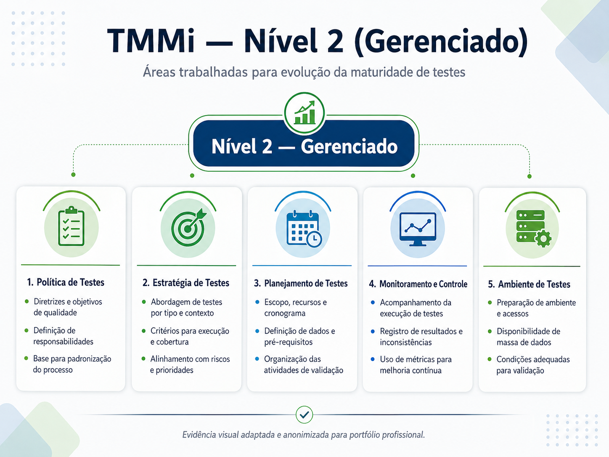

# Case 06 — Estudos de TMMi e Maturidade de Testes

## Resumo executivo

| Item | Descrição |
|------|-----------|
| **Período** | 2024 |
| **Papel** | QA / Evolução para liderança de QA |
| **Contexto** | Necessidade de avaliar a maturidade dos processos de teste da organização |
| **Objetivo** | Estudar o TMMi, identificar o nível inicial de aderência e estruturar práticas do Nível 2 |
| **Principal entrega** | Estudo de aderência ao TMMi, política de testes, estratégia de testes e planejamento de testes |
| **Impacto** | Processo de QA passou a ter direcionamento mais estruturado, documentado e alinhado à maturidade de testes |

## Contexto

Com a evolução da área de QA, surgiu a necessidade de avaliar a maturidade dos processos de testes e entender quais práticas poderiam ser adotadas para fortalecer a qualidade de software de forma mais estruturada.

Para isso, foi realizado um estudo sobre o TMMi — Test Maturity Model Integration, um modelo voltado à avaliação e melhoria da maturidade dos processos de teste.

---

## Desafio

O principal desafio era entender o que o TMMi solicitava, comparar essas práticas com o cenário atual da organização e identificar em qual nível de maturidade o processo de testes poderia se enquadrar inicialmente.

Também era necessário transformar esse estudo em ações práticas, aplicáveis ao contexto do time e compatíveis com a realidade ágil da empresa.

---

## Ação realizada

Realizei estudos sobre o TMMi, analisando suas áreas de processo, níveis de maturidade e recomendações para evolução dos testes dentro da organização.

A partir desse estudo, foi identificado que o caminho mais adequado seria iniciar a evolução pelo **Nível 2 — Gerenciado**.

Com base nas lacunas encontradas, comecei a trabalhar na estruturação de práticas e documentos fundamentais para esse nível, como:

- Política de testes;
- Estratégia de testes;
- Planejamento de testes;
- Monitoramento e controle de testes;
- Projeto e execução de testes;
- Gestão de ambiente de testes.

---

## Práticas relacionadas ao Nível 2

O estudo ajudou a direcionar ações relacionadas às áreas de processo do Nível 2 do TMMi, incluindo:

- Definição de objetivos e diretrizes de teste;
- Criação de uma visão mais clara sobre estratégia de testes;
- Planejamento baseado em riscos e prioridades;
- Definição de técnicas e tipos de teste;
- Acompanhamento dos resultados de testes;
- Uso de métricas para melhoria contínua;
- Registro de evidências e inconsistências;
- Organização do ambiente de testes.

---

## Resultado

O estudo de TMMi contribuiu para elevar a maturidade do processo de QA, trazendo uma visão mais estruturada sobre o que precisava ser criado, ajustado ou fortalecido.

A partir dele, foi possível iniciar a criação de documentos e práticas que ajudaram a tornar o processo de testes mais:

- Documentado;
- Planejado;
- Rastreável;
- Mensurável;
- Orientado a riscos;
- Alinhado à melhoria contínua;
- Integrado ao ciclo de desenvolvimento.

---

## Evidência visual adaptada

A imagem abaixo representa, de forma simplificada e anonimizada, o estudo de aderência ao TMMi e a identificação do Nível 2 — Gerenciado como ponto inicial para evolução da maturidade dos processos de teste.

A partir desse estudo, foram priorizadas práticas relacionadas à estruturação de política de testes, estratégia de testes, planejamento de testes, monitoramento e controle, além da gestão de ambiente de testes.

Essa análise ajudou a direcionar a evolução do processo de QA, transformando lacunas identificadas no estudo em ações práticas para tornar os testes mais planejados, documentados, monitorados e alinhados à melhoria contínua.

---

## Competências demonstradas

- TMMi;
- Maturidade de testes;
- Melhoria de processos;
- Política de testes;
- Estratégia de testes;
- Planejamento de testes;
- Monitoramento e controle;
- Gestão de riscos;
- Governança de QA;
- Qualidade de software;
- Melhoria contínua.

---

## O que aprendi com este case

Aprendi que maturidade em testes não acontece apenas com execução, mas com processo, estratégia, documentação, monitoramento e melhoria contínua.

Esse case reforçou a importância de usar modelos de referência, como o TMMi, para entender o nível atual do processo, identificar lacunas e transformar boas práticas em ações aplicáveis à realidade do time.

---

## Observação

Este case foi adaptado e anonimizado para fins de portfólio profissional, preservando informações sensíveis da organização.

---

[⬅ Voltar ao início do portfólio](../README.md)
