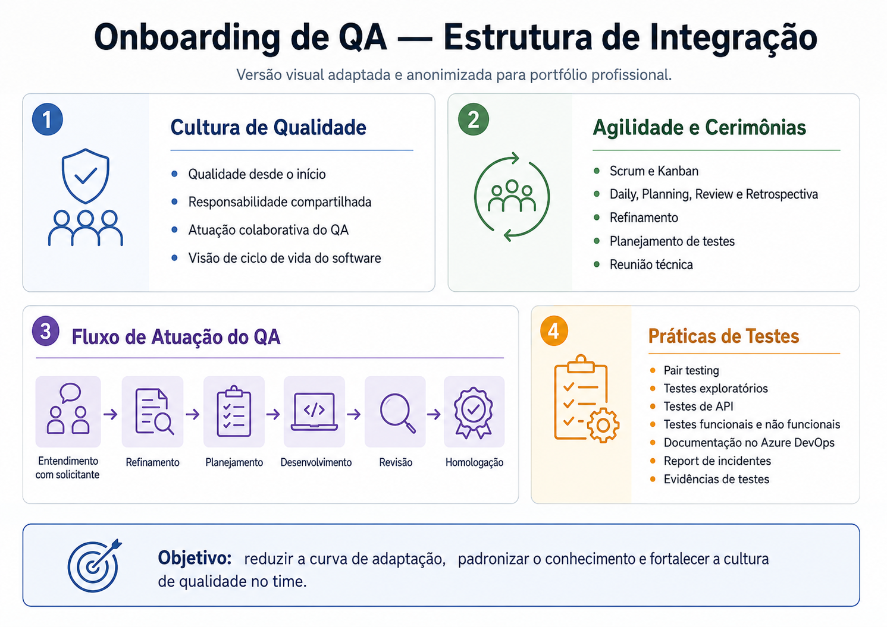

# Case 08 — Onboarding e Capacitação de QA

## Resumo executivo

| Item | Descrição |
|------|-----------|
| **Período** | 2024–atual |
| **Papel** | QA / Liderança de QA |
| **Contexto** | Entrada de novos colaboradores no time e necessidade de padronizar o conhecimento inicial |
| **Objetivo** | Apresentar processos, práticas, ferramentas e cultura de qualidade para novos QAs |
| **Principal entrega** | Onboarding estruturado do time de QA |
| **Impacto** | Redução da curva de adaptação e maior alinhamento sobre processos, responsabilidades e fluxo de trabalho |

## Contexto

Com a evolução do time de QA e a entrada de novos colaboradores, surgiu a necessidade de padronizar a forma como os processos, práticas, ferramentas e cultura de qualidade eram apresentados.

O onboarding passou a ser uma etapa importante para reduzir a curva de adaptação dos novos integrantes e garantir alinhamento desde o início.

---

## Desafio

O principal desafio era apresentar de forma clara o papel do QA dentro do ciclo de vida do software, mostrando que qualidade não acontece apenas na etapa final de testes.

Era necessário explicar:

- Como o QA atua dentro dos times;
- Quais processos são utilizados;
- Como funcionam as cerimônias;
- Como documentar testes;
- Como registrar bugs;
- Como evidenciar validações;
- Como usar o Azure DevOps no fluxo de QA;
- Como colaborar com Produto e Desenvolvimento.

---

## Ação realizada

Estruturei e conduzi o onboarding de novos colaboradores do time de TI.

Durante o onboarding, eram apresentados temas como:

- Cultura de qualidade;
- Papel do QA no ciclo de vida do software;
- Responsabilidade compartilhada pela qualidade;
- Metodologias ágeis;
- Scrum;
- Cerimônias do time;
- Reuniões de refinamento;
- Planejamento de testes;
- Reunião técnica;
- Fluxo de QA dentro dos times;
- Documentação de testes;
- Evidências;
- Abertura de bugs;
- Report de incidentes;
- Pair testing;
- Testes exploratórios;
- Testes de API;
- Testes funcionais e não funcionais;
- Automação de testes em implantação.

---

## Qualidade desde o início

O onboarding reforçava a importância da participação do QA em todas as etapas do ciclo de desenvolvimento, desde a concepção da ideia até a entrega.

A ideia era mostrar que o QA atua de forma colaborativa, ajudando o time a aplicar boas práticas, identificar riscos, melhorar requisitos, documentar testes e contribuir para a qualidade do produto.

---

## Resultado

A criação e condução do onboarding contribuiu para:

- Redução da curva de adaptação de novos colaboradores;
- Maior alinhamento sobre processos internos;
- Padronização da atuação do time;
- Melhor entendimento do fluxo de QA;
- Fortalecimento da cultura de qualidade;
- Clareza sobre responsabilidades;
- Melhor integração entre novos colaboradores e o time;
- Continuidade das práticas implantadas.

---

## Evidência visual adaptada

A imagem abaixo representa, de forma simplificada e anonimizada, a estrutura do onboarding criado para apoiar a entrada de novos colaboradores no time de QA.

O material apresentava a cultura de qualidade, o papel do QA no ciclo de vida do software, metodologias ágeis, cerimônias, fluxo de atuação dentro dos times, práticas de testes, documentação no Azure DevOps e report de incidentes.

Essa iniciativa ajudou a transformar conhecimento interno em um material reutilizável, reduzindo a curva de adaptação de novos colaboradores e fortalecendo a padronização da atuação do time de QA.

---

## Competências demonstradas

- Onboarding;
- Capacitação de time;
- Liderança em QA;
- Cultura de qualidade;
- Comunicação;
- Documentação de processos;
- Azure DevOps;
- Scrum;
- Planejamento de testes;
- Gestão de bugs;
- Formação de pessoas;
- Padronização de processos.

---

## O que aprendi com este case

Aprendi que onboarding não é apenas apresentar ferramentas e processos, mas ajudar a nova pessoa a entender a cultura, o propósito e a forma como o time trabalha.

Esse case reforçou que um onboarding bem estruturado reduz a curva de adaptação, fortalece a padronização do time e ajuda novos colaboradores a se sentirem mais seguros para atuar dentro do fluxo de QA.

---

## Observação

Este case foi adaptado e anonimizado para fins de portfólio profissional, preservando informações sensíveis da organização.

---

[⬅ Voltar ao início do portfólio](../README.md)
