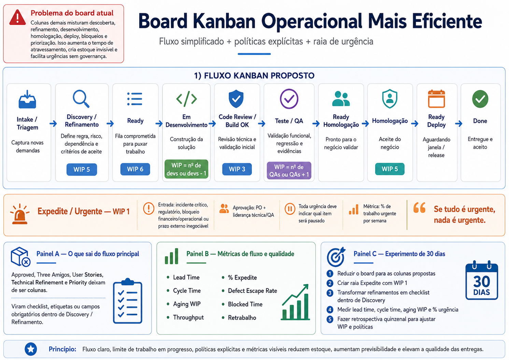

# Case 11 — Estruturação de Framework Kanban Operacional

## Visão geral

Este case apresenta a estruturação de um framework Kanban operacional para
simplificar o fluxo de trabalho, tornar gargalos visíveis, limitar o trabalho
em progresso e estabelecer uma política clara para demandas urgentes.

A proposta surgiu a partir da análise de um board com excesso de colunas,
múltiplos pontos de espera e atividades de refinamento representadas como
etapas permanentes do fluxo.

O trabalho encontra-se em fase de estruturação e validação.

---

## Contexto

O board utilizado pela equipe misturava no mesmo fluxo:

- descoberta;
- refinamento;
- priorização;
- desenvolvimento;
- revisão técnica;
- testes;
- homologação;
- deploy;
- bloqueios;
- demandas urgentes.

A quantidade elevada de colunas dificultava a leitura do fluxo real e criava
estoques intermediários pouco visíveis.

Também havia risco de aumento do tempo de atravessamento, excesso de handoffs
e entrada de urgências sem critérios explícitos de governança.

---

## Problema identificado

A análise inicial indicou os seguintes pontos:

- excesso de etapas no fluxo principal;
- atividades de refinamento tratadas como colunas;
- ausência de limites claros de trabalho em progresso;
- dificuldade para distinguir fila, trabalho ativo e espera;
- pouca visibilidade sobre gargalos e itens envelhecidos;
- entrada de demandas urgentes sem política objetiva;
- aumento de handoffs entre áreas;
- risco de acúmulo de trabalho parcialmente concluído.

---

## Objetivo

Estruturar um fluxo Kanban operacional mais simples, previsível e orientado
por dados, preservando as etapas necessárias de qualidade sem transformar
cada atividade em uma coluna do board.

A proposta busca:

- reduzir estoques intermediários;
- diminuir handoffs desnecessários;
- limitar o trabalho em progresso;
- tornar bloqueios e esperas visíveis;
- melhorar a previsibilidade;
- estabelecer governança para urgências;
- acompanhar métricas de fluxo e qualidade;
- incentivar a conclusão do trabalho antes do início de novos itens.

---

## Fluxo Kanban proposto

O fluxo principal foi reorganizado nas seguintes etapas:

| Etapa | Objetivo | Política de entrada e saída |
|---|---|---|
| **Intake / Triagem** | Capturar novas demandas | Só entra com descrição mínima, solicitante, impacto e prazo desejado |
| **Discovery / Refinamento** | Entender regra, risco, dependências e critérios de aceite | Sai com critérios de aceite claros, prioridade validada e tamanho estimado |
| **Ready** | Manter a fila comprometida para execução | Deve possuir limite forte e não funcionar como depósito |
| **Em Desenvolvimento** | Construir a solução | WIP limitado pela capacidade real do time |
| **Code Review / Build OK** | Realizar revisão técnica e validação inicial | Build, testes unitários e revisão concluídos |
| **Teste / QA** | Validar funcionalidade, regressão, riscos e evidências | Critérios de aceite validados e defeitos tratados |
| **Ready Homologação** | Disponibilizar o item para validação do negócio | Ambiente estável e evidências disponíveis |
| **Homologação** | Obter o aceite do negócio | Deve possuir SLA e política para itens sem validação |
| **Ready Deploy** | Aguardar janela de publicação | Checklist de deploy e rollback concluído |
| **Done** | Representar trabalho entregue e aceito | Deploy, evidências e comunicação finalizados |

---

## Simplificação do board

Algumas atividades deixam de ser colunas do fluxo principal:

- Approved;
- Three Amigos;
- User Stories;
- Technical Refinement;
- Priority.

Esses elementos passam a ser tratados como:

- checklists;
- campos obrigatórios;
- etiquetas;
- critérios de entrada e saída;
- políticas explícitas dentro de Discovery / Refinamento.

Essa mudança reduz handoffs sem eliminar controles importantes.

---

## Governança para demandas urgentes

Foi proposta uma raia específica chamada:

Expedite / Urgente

A raia possui regras mais restritivas para evitar que se transforme em um
atalho permanente de priorização.

| Política | Definição |
|---|---|
| **Limite WIP** | Máximo de 1 item urgente por vez |
| **Critério de entrada** | Incidente crítico, obrigação regulatória, bloqueio financeiro ou operacional ou prazo externo inegociável |
| **Aprovação** | Produto, liderança técnica e QA |
| **Custo visível** | Toda urgência deve indicar qual item será pausado ou despriorizado |
| **Métrica** | Acompanhar semanalmente o percentual de trabalho urgente |

> Se tudo é urgente, nada é urgente.

A raia Expedite deve proteger o fluxo, e não funcionar como um atalho político.

---

## Limites iniciais de WIP

Os limites abaixo representam uma proposta inicial e devem ser ajustados com
base nos dados reais do time:

| Etapa | WIP inicial |
|---|---:|
| Discovery / Refinamento | 5 |
| Ready | 6 |
| Desenvolvimento | Número de desenvolvedores ou desenvolvedores menos 1 |
| Code Review / Build OK | 3 |
| Teste / QA | Número de QAs ou QAs mais 1 |
| Homologação | 5 |
| Expedite | 1 |

A recomendação é revisar esses limites após duas ou três semanas de operação.

---

## Métricas propostas

As métricas selecionadas permitem acompanhar fluxo, previsibilidade e
qualidade.

### Métricas de fluxo

- **Lead Time:** tempo entre a entrada na triagem e a conclusão em Done;
- **Cycle Time:** tempo entre o início do desenvolvimento e Done;
- **Aging WIP:** idade dos itens ainda em andamento;
- **Throughput:** quantidade de itens concluídos por período;
- **Blocked Time:** tempo em que os itens permanecem impedidos;
- **Percentual de Expedite:** proporção de trabalho urgente no período.

### Métricas de qualidade

- **Defect Escape Rate:** defeitos que escapam para homologação ou produção;
- **Retrabalho:** itens que retornam de QA ou homologação;
- **Taxa de retorno:** itens movimentados para etapas anteriores;
- **Tempo em homologação:** período entre disponibilidade e aceite do negócio.

---

## Estratégia de implantação

A proposta será avaliada por meio de um experimento inicial de 30 dias.

### Etapas do experimento

1. Reduzir o board para as colunas propostas.
2. Criar a raia Expedite com WIP máximo de 1.
3. Transformar atividades de refinamento em checklists ou políticas.
4. Definir limites iniciais de WIP.
5. Medir lead time, cycle time, aging WIP e percentual de urgências.
6. Realizar retrospectivas quinzenais.
7. Ajustar políticas e limites com base nos dados coletados.

---

## Evidência visual

A imagem abaixo consolida o diagnóstico, a proposta de fluxo, os limites
iniciais de WIP, as políticas de urgência e o experimento de 30 dias.

---

## Resultados esperados

Como a iniciativa ainda está em fase de estruturação, os resultados abaixo
representam hipóteses a serem validadas durante o experimento:

- redução do trabalho em progresso;
- maior visibilidade dos gargalos;
- diminuição do tempo de espera entre etapas;
- redução de demandas urgentes sem governança;
- aumento da previsibilidade;
- maior foco na conclusão do trabalho;
- melhoria da rastreabilidade;
- melhor equilíbrio entre desenvolvimento, QA e negócio.

Os resultados efetivos serão registrados após a coleta e análise dos dados.

---

## Competências demonstradas

- Kanban;
- gestão de fluxo;
- definição de limites de WIP;
- governança de demandas urgentes;
- análise de processos;
- melhoria contínua;
- métricas de fluxo;
- métricas de qualidade;
- liderança de QA;
- facilitação entre áreas;
- pensamento sistêmico;
- gestão de riscos.

---

## Referências

A proposta foi fundamentada em práticas e conceitos presentes em:

- *More Agile Testing* — visualização das atividades de teste, foco na
  conclusão e uso de limites de WIP;
- *TMMi in the DevOps World v1.1* — acompanhamento do progresso, visibilidade
  do trabalho e preservação do fluxo;
- *ISTQB CTFL-AT Agile Tester* — uso de quadros ágeis para visualizar tarefas,
  movimentação do trabalho e bloqueios;
- princípios de Kanban relacionados a sistema puxado, gestão de fluxo,
  políticas explícitas e melhoria evolutiva.

---

## Status do case

**Em estruturação e implantação**

Este documento será atualizado à medida que o experimento avançar e dados
reais forem coletados.
