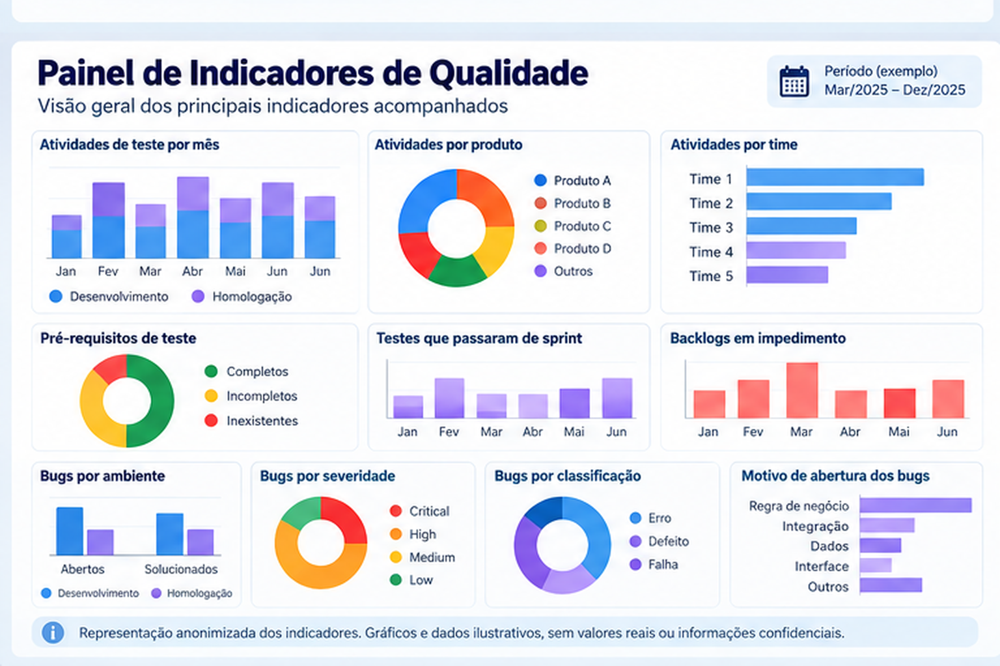
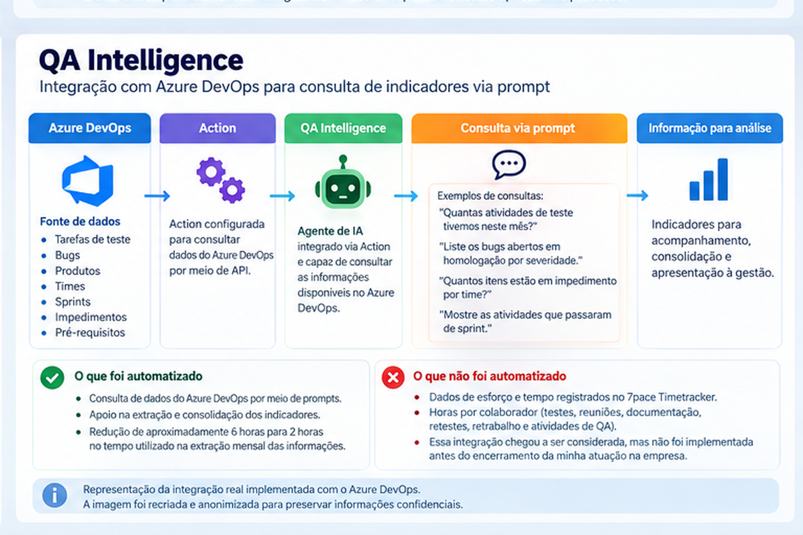

# Case 14 — KPIs e Governança de Qualidade com Azure DevOps

## Visão geral

Este case apresenta a estruturação e evolução de indicadores utilizados para apoiar o acompanhamento da operação de QA, a análise de Qualidade e a comunicação de informações à gestão.

Os KPIs foram construídos a partir de dados registrados principalmente no **Azure DevOps** e, para indicadores relacionados ao uso do tempo, no **7pace Timetracker**.

Posteriormente, parte da consulta aos dados do Azure DevOps evoluiu com a criação do **QA Intelligence**, agente de IA configurado com uma Action integrada à ferramenta e capaz de responder consultas realizadas por prompt.

> **Nota sobre confidencialidade:** os dados, números, produtos e informações apresentados visualmente neste case foram anonimizados ou recriados.

---

## Contexto

Com a evolução da área de QA e o aumento do volume de atividades, tornou-se necessário acompanhar a operação por meio de indicadores.

A intenção não era medir apenas quantidade de testes ou defeitos, mas construir uma visão mais ampla sobre:

- esforço do time;
- volume de atividades;
- fluxo de testes;
- qualidade dos pré-requisitos;
- impedimentos;
- defeitos;
- comportamento das entregas;
- distribuição das demandas.

A estruturação dos indicadores utilizou como referência práticas de gestão de testes e maturidade estudadas a partir do **TMMi** e de conteúdos do **BSTQB/ISTQB**.

---

## Fontes utilizadas

Os indicadores eram obtidos a partir de duas fontes principais, com funções diferentes.

### Azure DevOps

Utilizado para informações relacionadas a:

- tarefas de teste;
- produtos;
- times;
- Sprints;
- impedimentos;
- bugs;
- severidade;
- classificação;
- motivo de abertura;
- ambiente de identificação do defeito.

### 7pace Timetracker

Utilizado pelo time para registro das horas dedicadas às diferentes atividades de QA.

Esses dados eram posteriormente extraídos e consolidados manualmente.

---

## Indicadores de esforço e utilização do tempo

Os dados registrados no 7pace permitiam analisar o esforço por colaborador.

Entre as categorias acompanhadas estavam:

- horas gastas em testes;
- horas gastas em reuniões;
- horas gastas em documentação;
- horas gastas em retestes;
- horas relacionadas a retrabalho;
- horas dedicadas a atividades de QA.

Os dados eram analisados individualmente por integrante do time e ajudavam a compreender como o esforço estava distribuído.

> Esses indicadores continuaram sendo extraídos manualmente. O QA Intelligence não chegou a ser integrado ao 7pace Timetracker.

---

## Indicadores de atividades de teste

A partir das informações existentes no Azure DevOps, eram acompanhados indicadores como:

- quantidade de atividades de teste por mês;
- atividades executadas em Desenvolvimento;
- atividades executadas em Homologação;
- quantidade de atividades por produto;
- quantidade de atividades por time;
- quantidade de atividades que passaram de uma Sprint para outra.

Esses dados ajudavam a observar volume, distribuição e comportamento do fluxo de validação.

---

## Indicadores relacionados aos pré-requisitos de teste

Também era acompanhado o estado dos pré-requisitos necessários para execução dos testes.

Os registros eram classificados como:

- completos;
- incompletos;
- inexistentes.

Esse indicador ajudava a identificar situações em que QA recebia uma demanda sem as condições necessárias para uma validação adequada.

---

## Indicadores de impedimento

Outro ponto acompanhado era a quantidade de itens em impedimento.

Esse tipo de informação ajudava a visualizar situações em que o trabalho de QA não avançava devido a dependências ou bloqueios existentes no fluxo.

---

## Indicadores de defeitos

A análise de defeitos incluía diferentes perspectivas.

### Por ambiente

- bugs abertos em Desenvolvimento;
- bugs abertos em Homologação;
- bugs solucionados em Desenvolvimento;
- bugs solucionados em Homologação;
- bugs reportados pelo cliente.

### Por severidade

- Low;
- Medium;
- High;
- Critical.

### Por classificação

- erro;
- defeito;
- falha.

### Por motivo

Também eram analisados os motivos relacionados à abertura dos bugs, permitindo observar padrões e possíveis oportunidades de melhoria no processo.

---

## Apresentação dos KPIs

Os indicadores eram consolidados e apresentados periodicamente à gestão por meio de materiais visuais.

Os slides permitiam acompanhar diferentes dimensões da operação de Qualidade e funcionavam como apoio para análise, discussão e tomada de decisão.

  

> **Representação anonimizada:** o painel apresentado neste case será recriado com base nos tipos de indicadores efetivamente utilizados, sem reproduzir dados, produtos, colaboradores ou informações internas.

---

## Evolução com o QA Intelligence

A preparação mensal dos KPIs exigia tempo para consulta, extração e consolidação das informações.

Como evolução desse processo, foi criado o **QA Intelligence**, agente de IA configurado para consultar dados do Azure DevOps.

A integração foi realizada por meio de uma **Action**, permitindo que informações existentes no Azure DevOps fossem consultadas por meio de prompts.

De forma simplificada:

**Azure DevOps → Action → QA Intelligence → consulta via prompt → informação para análise**

  

O agente apoiava a consulta e a consolidação de indicadores provenientes do Azure DevOps.

A utilização dessa abordagem reduziu de aproximadamente **6 horas para 2 horas** o tempo utilizado na extração mensal das informações para os KPIs apresentados à gestão.

---

## Limites da automação

O QA Intelligence não automatizou todo o processo de indicadores.

A solução implementada consultava informações disponíveis no **Azure DevOps**.

Os dados registrados no **7pace Timetracker**, relacionados principalmente ao esforço e às horas utilizadas pelo time, continuavam sendo extraídos manualmente.

A integração entre o QA Intelligence e o 7pace chegou a ser considerada como uma possível evolução, mas **não foi implementada antes do encerramento da minha atuação na empresa**.

Portanto, a solução deve ser entendida como uma automação parcial do processo de consulta e consolidação de KPIs.

---

## Papel da análise humana

O agente não substituía a análise dos indicadores.

Seu papel estava relacionado principalmente à obtenção e organização das informações.

A interpretação continuava dependendo de:

- conhecimento do contexto;
- análise crítica;
- entendimento do fluxo de trabalho;
- acompanhamento do time;
- avaliação das particularidades de cada produto;
- tomada de decisão humana.

Essa separação foi importante para manter o uso da IA como ferramenta de apoio, e não como responsável pelas decisões de gestão.

---

## Resultados observados

A estruturação dos KPIs contribuiu para:

- maior visibilidade sobre a operação de QA;
- acompanhamento de esforço e distribuição de atividades;
- análise do volume de testes;
- acompanhamento de impedimentos;
- identificação de padrões relacionados aos defeitos;
- maior rastreabilidade das informações;
- comunicação mais estruturada com a gestão.

A evolução com o QA Intelligence permitiu:

- consultar dados do Azure DevOps por meio de prompts;
- reduzir o esforço manual de extração;
- diminuir de aproximadamente 6 para 2 horas o tempo necessário para a extração mensal das informações utilizadas nos KPIs;
- experimentar o uso de IA integrada a uma ferramenta de gestão de trabalho.

---

## Competências demonstradas

- Gestão de indicadores;
- KPIs de Qualidade;
- governança;
- Azure DevOps;
- 7pace Timetracker;
- rastreabilidade;
- análise de dados;
- gestão de fluxo;
- gestão de defeitos;
- liderança de QA;
- comunicação com gestão;
- melhoria contínua;
- automação de processos;
- configuração de Actions;
- IA aplicada à Qualidade de Software.

---

## Aprendizados

A experiência mostrou que a quantidade de dados disponível em uma ferramenta não é suficiente para produzir informação útil.

O primeiro passo foi definir quais perguntas precisavam ser respondidas.

Depois, foi necessário transformar os registros existentes em indicadores que ajudassem a compreender o comportamento da operação.

A introdução do QA Intelligence trouxe uma nova etapa dessa evolução: reduzir o esforço necessário para consultar os dados sem retirar da liderança a responsabilidade de interpretá-los.

Um dos principais aprendizados foi:

> **Automatizar a obtenção da informação não significa automatizar a decisão.**

---

## Observação sobre as imagens

As imagens apresentadas neste case são representações visuais anonimizadas ou recriadas com base no processo e nos indicadores realmente utilizados.

Nenhum dado de colaborador, produto, cliente ou sistema interno é reproduzido.
