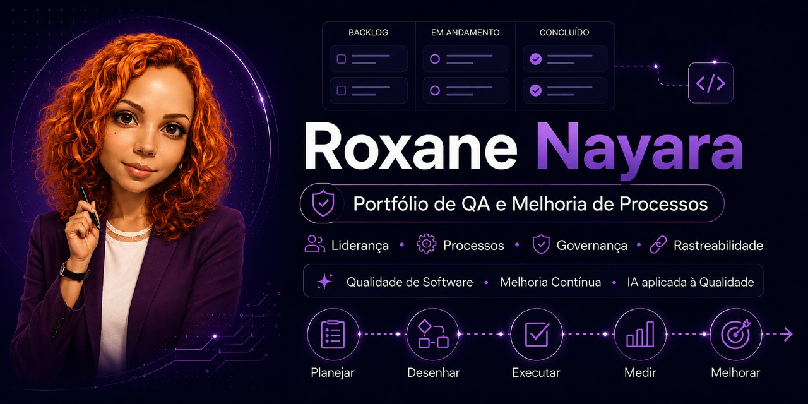

  

  
  
  
  
  
  

## Sobre o portfólio

Este repositório reúne cases profissionais relacionados à minha atuação como **QA Lead e Coordenadora de QA**, com foco em processos, governança, rastreabilidade, maturidade de testes, liderança, gestão de fluxo, gestão de riscos, indicadores e inteligência artificial aplicada à Qualidade de Software.

Os materiais apresentam diagnósticos, práticas implementadas ou em evolução, aprendizados e evidências adaptadas para preservar informações confidenciais.

> Informações internas, nomes de clientes, sistemas e conteúdos proprietários foram omitidos, anonimizados ou recriados.

---

## Em uma frase

Transformei um cenário sem QA estruturado em uma atuação orientada por processos, rastreabilidade, governança, liderança, gestão de fluxo, cultura de qualidade e melhoria contínua, incorporando também dados e inteligência artificial como apoio à análise e à tomada de decisão.

---

## Como este portfólio está organizado

Este portfólio reúne diferentes tipos de evidência profissional:

- **Cases profissionais:** iniciativas desenvolvidas no contexto da minha atuação profissional, com informações adaptadas, anonimizadas ou recriadas para preservar a confidencialidade;
- **Projetos autorais:** iniciativas independentes criadas para estudo, prática, experimentação e demonstração técnica;
- **POCs e estudos:** avaliações, experimentos e aprendizados apresentados de acordo com seu estágio real de desenvolvimento.

Cada material apresenta, conforme sua natureza:

- contexto;
- problema ou desafio;
- diagnóstico e evidências disponíveis;
- abordagem adotada;
- ações realizadas ou propostas;
- resultados observados, esperados ou ainda não avaliados;
- competências demonstradas;
- aprendizados e próximos passos.

A proposta é demonstrar tanto as entregas realizadas quanto o raciocínio aplicado à análise dos problemas, os critérios utilizados nas decisões e a evolução da minha atuação em Qualidade de Software.

---

## Navegação rápida

- [Linha do tempo da evolução](#linha-do-tempo-da-evolução)
- [Principais entregas](#principais-entregas)
- [Cases do portfólio](#cases-do-portfólio)
- [Projetos autorais relacionados](#projetos-autorais-relacionados)
- [Competências e temas abordados](#competências-e-temas-abordados)
- [Tecnologias, ferramentas e referências](#tecnologias-ferramentas-e-referências)
- [Meu posicionamento profissional](#meu-posicionamento-profissional)
- [Observação sobre confidencialidade](#observação-sobre-confidencialidade)

---

## Linha do tempo da evolução

### 2023 — Diagnóstico e início da estruturação

- Início da atuação em QA em um cenário sem time formal estruturado;
- realização do diagnóstico AS-IS de maturidade em testes;
- levantamento de práticas existentes, parciais e inexistentes;
- início da implantação de processos de QA;
- participação na estruturação de fluxo ágil com Scrum e Kanban;
- evolução da documentação e das evidências de testes.

### 2024 — Padronização, governança e maturidade

- Expansão dos processos de QA para produtos Web e Desktop;
- criação e evolução de práticas de planejamento, documentação e evidência;
- estruturação de atividades de QA no Azure DevOps;
- participação na criação da Definition of Done com critérios de qualidade;
- criação de Matriz RACI para QA e Desenvolvimento;
- estudos de TMMi e identificação de aderência inicial ao Nível 2;
- criação de política, estratégia e planejamento de testes;
- POC para avaliação e escolha de ferramenta de automação de testes;
- criação de checklist de boas práticas de Qualidade de Software.

### 2025/2026 — Liderança, cultura, gestão de fluxo e inovação

- Atuação como Coordenadora de QA;
- coordenação e desenvolvimento do time de QA;
- condução de onboarding para novos colaboradores;
- disseminação da cultura de qualidade entre áreas de tecnologia;
- participação em processos seletivos técnicos e formação do time;
- elaboração de questionários e critérios para avaliação de candidatos;
- apoio à evolução da automação de testes com Playwright;
- planejamento e realização de webinar interno para compartilhamento de conhecimento;
- consolidação de práticas de qualidade, rastreabilidade, governança e melhoria contínua;
- estruturação de framework Kanban operacional, com simplificação do fluxo, limites de WIP, políticas explícitas, governança de urgências e métricas;
- condução de fórum multidisciplinar para análise e acompanhamento de riscos com Produto, Desenvolvimento, Arquitetura e Privacidade;
- evolução dos indicadores de Qualidade com dados do Azure DevOps e apoio do 7pace Timetracker;
- configuração de agentes de IA aplicados à Qualidade de Software, com definição de objetivo, escopo, comportamento, método de análise, base de conhecimento e critérios de confiabilidade;
- criação do QA Intelligence para apoiar consulta e consolidação de indicadores de Qualidade;
- criação do Prisma QA para apoio à análise crítica de processos, regras de negócio, riscos e cenários de teste.

---

## Principais entregas

- Estruturação inicial da área de QA a partir de diagnóstico AS-IS;
- implantação e evolução de processos de qualidade em produtos Web e Desktop;
- estruturação do fluxo de QA nas Sprints e cerimônias ágeis;
- evolução da documentação de testes para o Azure DevOps;
- implementação de evidências em vídeo e rastreabilidade das validações;
- definição de critérios de qualidade para a Definition of Done;
- criação de Matriz RACI para QA e Desenvolvimento;
- estudos de aderência ao TMMi e início da estruturação de práticas relacionadas ao Nível 2;
- elaboração de política, estratégia e planejamento de testes;
- participação em POC para avaliação e escolha do Playwright como ferramenta de automação;
- estruturação de onboarding e capacitação de profissionais de QA;
- desenvolvimento de checklist de boas práticas de qualidade;
- disseminação da cultura de qualidade para o time de TI;
- participação em processos seletivos técnicos e formação do time de QA;
- planejamento e realização de webinar interno para compartilhamento de conhecimento;
- estruturação de framework Kanban operacional para gestão de fluxo, limites de WIP, demandas urgentes e métricas de previsibilidade e qualidade;
- estruturação de abordagem multidisciplinar para identificação, análise e acompanhamento de riscos relacionados às entregas;
- estruturação de indicadores de Qualidade utilizando dados do Azure DevOps e do 7pace Timetracker;
- criação do Prisma QA como agente de IA para apoio à análise crítica de processos, regras de negócio, critérios de aceite, planejamento de testes, riscos e melhoria contínua;
- criação do QA Intelligence, integrado ao Azure DevOps, reduzindo de 6 para 2 horas o tempo utilizado na extração mensal dos indicadores apresentados à gestão.

---

## Cases do portfólio

| Case | Tema | Foco principal |
|------|------|----------------|
| [Case 01](01-as-is-maturidade-qa) | Diagnóstico AS-IS de Testes de Software | Mapeamento de maturidade, levantamento inicial e identificação de lacunas |
| [Case 02](02-implantacao-processos-qa) | Implantação de Processos de QA | Estruturação de fluxo, cerimônias, documentação, bugs e pair testing |
| [Case 03](03-azure-devops-rastreabilidade) | Azure DevOps e Rastreabilidade | Evolução de controles em Excel para um fluxo integrado e rastreável |
| [Case 04](04-definition-of-done-qualidade) | Definition of Done com Critérios de Qualidade | Inclusão de práticas de QA nos critérios de conclusão das entregas |
| [Case 05](05-matriz-raci-governanca) | Governança com Matriz RACI | Clareza de papéis, responsabilidades, aprovações e comunicação |
| [Case 06](06-tmmi-maturidade-testes) | Estudos de TMMi e Maturidade de Testes | Avaliação de maturidade e estruturação de política, estratégia e planejamento |
| [Case 07](07-poc-automacao-playwright) | POC de Automação com Playwright | Estudo de ferramenta, aderência técnica e início da automação |
| [Case 08](08-onboarding-capacitacao-qa) | Onboarding e Capacitação de QA | Integração de novos colaboradores e padronização do conhecimento |
| [Case 09](09-cultura-qualidade-conhecimento) | Cultura de Qualidade e Conhecimento | Disseminação de boas práticas, checklist e webinar interno |
| [Case 10](10-lideranca-processo-seletivo-qa) | Liderança e Processo Seletivo de QA | Avaliação técnica, entrevistas, questionário e formação de time |
| [Case 11](11-framework-kanban-operacional) | Estruturação de Framework Kanban Operacional | Simplificação do fluxo, limites de WIP, governança de urgências e métricas de previsibilidade e qualidade |
| [Case 12](12-configuracao-agente-ia-qa) | Configuração de Agente de IA Especializado em Qualidade de Software | Estruturação de comportamento, método de análise, base de conhecimento e aplicação prática por meio do Prisma QA |
| [Case 13](13-gestao-riscos-qualidade) | Gestão de Riscos Aplicada à Qualidade de Software | Identificação, análise e acompanhamento de riscos em colaboração com Produto, Desenvolvimento, Arquitetura e Privacidade |
| [Case 14](14-kpis-governanca-qualidade) | KPIs e Governança de Qualidade com Azure DevOps | Estruturação de indicadores, rastreabilidade e apoio à tomada de decisão, com evolução por meio do QA Intelligence |

---

## Projetos autorais relacionados

### Playwright Automation Lab

**Classificação:** Projeto autoral de estudo, experimentação e demonstração técnica.

O Playwright Automation Lab foi desenvolvido com Playwright e TypeScript como um ambiente estruturado para explorar diferentes frentes de Qualidade de Software.

O projeto reúne três trilhas principais:

- **Web:** 23 cenários automatizados e 69 execuções cross-browser em Chromium, Firefox e WebKit, utilizando TodoMVC e SauceDemo, além de acessibilidade automatizada com Axe Core;
- **API:** 16 cenários automatizados cobrindo operações CRUD, busca, paginação, cenários negativos e testes de robustez com a DummyJSON API;
- **LLM:** suíte experimental dedicada à qualidade de sistemas baseados em modelos de linguagem, com cenários de RAG, embeddings, evals, groundedness, prompt injection, Agents e Tool Calling, regressão, observabilidade, controle de custo, métricas de retrieval, structured output e preparação e avaliação de Fine-tuning.

O laboratório também utiliza GitHub Actions, ESLint, Prettier, relatórios Playwright HTML e Allure, além de quality gates específicos para testes de sistemas com LLM.

O projeto demonstra aplicação prática de automação, arquitetura de testes, qualidade de código, integração contínua e avaliação de características de qualidade em aplicações Web, APIs e sistemas baseados em IA.

[Conhecer o Playwright Automation Lab](https://github.com/RoxaneNayara/playwright-automation-lab)

---

## Competências e temas abordados

- Liderança e coordenação de QA;
- estratégia e gestão de testes;
- análise crítica de processos;
- estruturação de práticas de qualidade;
- governança e rastreabilidade;
- gestão de riscos;
- testes baseados em risco;
- planejamento e estratégia de testes;
- análise de requisitos, regras de negócio e critérios de aceite;
- documentação e evidências;
- Definition of Done;
- Matriz RACI;
- TMMi;
- Azure DevOps;
- onboarding e capacitação;
- cultura de qualidade;
- Kanban e gestão de fluxo;
- limites de trabalho em progresso;
- métricas de fluxo e qualidade;
- indicadores de Qualidade;
- governança de demandas urgentes;
- configuração de agentes de IA;
- IA aplicada à Qualidade de Software;
- curadoria de bases de conhecimento;
- análise apoiada por dados;
- melhoria contínua.

---

## Tecnologias, ferramentas e referências

### Gestão, processos e governança

- Azure DevOps;
- Scrum;
- Kanban;
- TMMi;
- Matriz RACI;
- shift-left;
- gestão de riscos;
- métricas de fluxo e qualidade;
- indicadores de Qualidade;
- 7pace Timetracker;
- governança de demandas urgentes.

### Qualidade e testes

- testes funcionais;
- testes exploratórios;
- testes regressivos;
- testes Web, API e Desktop;
- pair testing;
- testes baseados em risco;
- análise de requisitos e regras de negócio;
- critérios de aceite;
- documentação, evidências e rastreabilidade.

### Automação e tecnologia

- Playwright;
- TypeScript;
- C#;
- GitHub Actions;
- CI/CD;
- relatórios Playwright HTML e Allure;
- Axe Core;
- testes de sistemas com LLM;
- RAG;
- embeddings;
- evals;
- Agents e Tool Calling;
- IA Generativa;
- agentes de IA aplicados à Qualidade de Software.

### Normas e referências

- ISO 9001;
- ISO 27001;
- ISO/IEC 25010;
- ISO/IEC/IEEE 29119;
- ISTQB.

---

## Meu posicionamento profissional

Atuo na construção e evolução de processos de Qualidade de Software, conectando QA, Produto, Desenvolvimento e Gestão para tornar a qualidade uma responsabilidade compartilhada desde o início do ciclo de desenvolvimento.

Meu foco está em transformar práticas soltas em processos claros, documentados, rastreáveis, mensuráveis e sustentáveis.

Como **QA Lead e Coordenadora de QA**, minha atuação combina liderança de pessoas, estratégia e gestão de testes, governança, análise de riscos, gestão de fluxo, indicadores, melhoria contínua e uso responsável de tecnologia e inteligência artificial aplicada à Qualidade.

---

## Observação sobre confidencialidade

Por confidencialidade, os materiais apresentados neste portfólio foram adaptados, anonimizados ou recriados com base em experiências reais, preservando informações sensíveis da organização, colaboradores, sistemas, clientes e processos internos.
